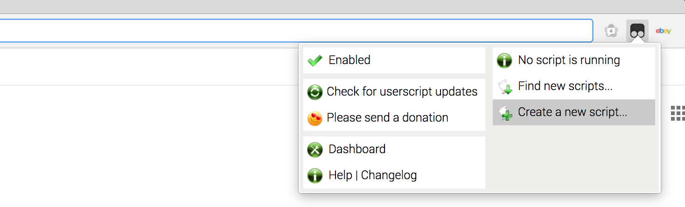
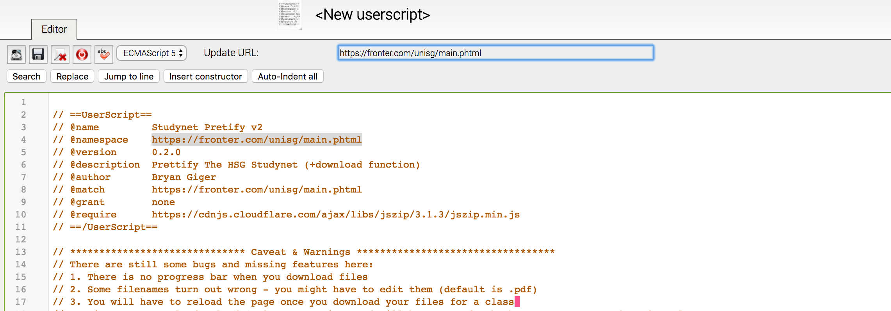
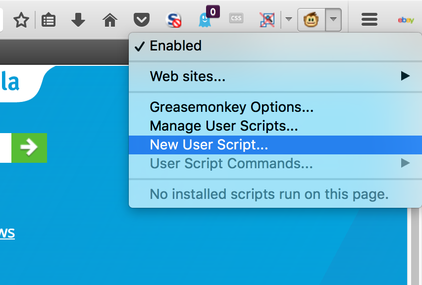
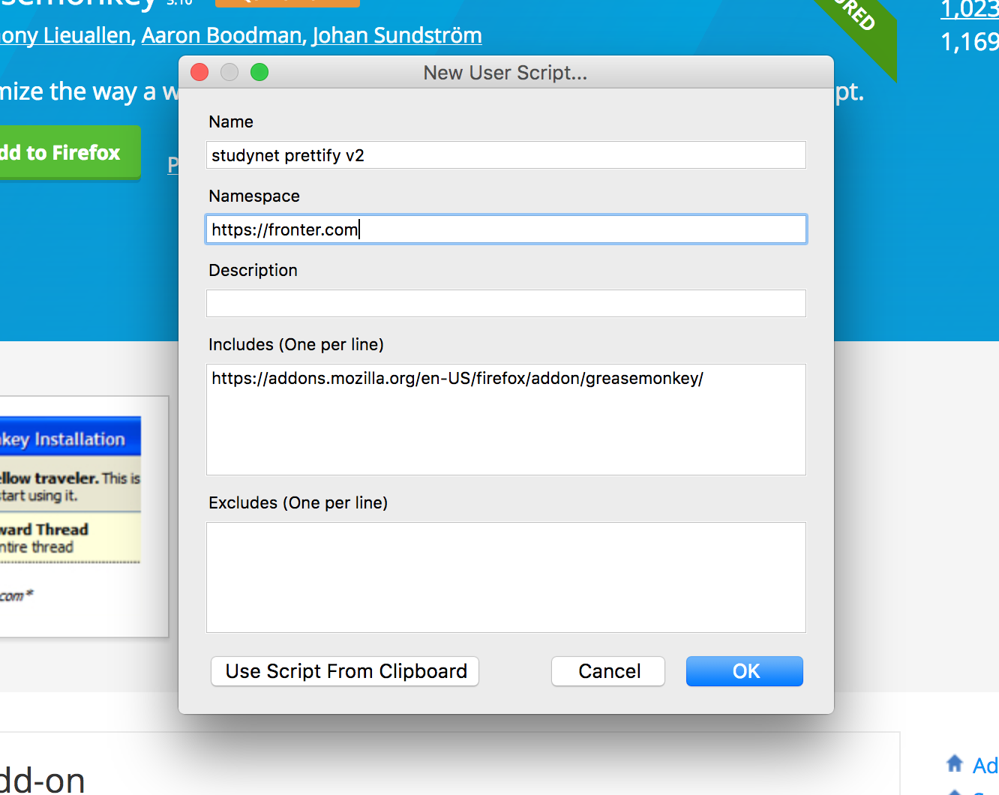
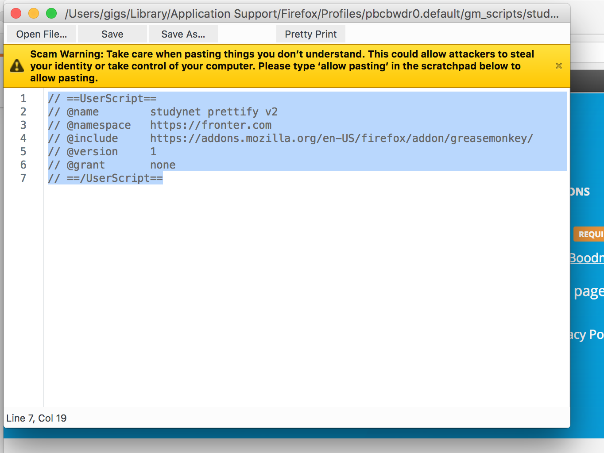
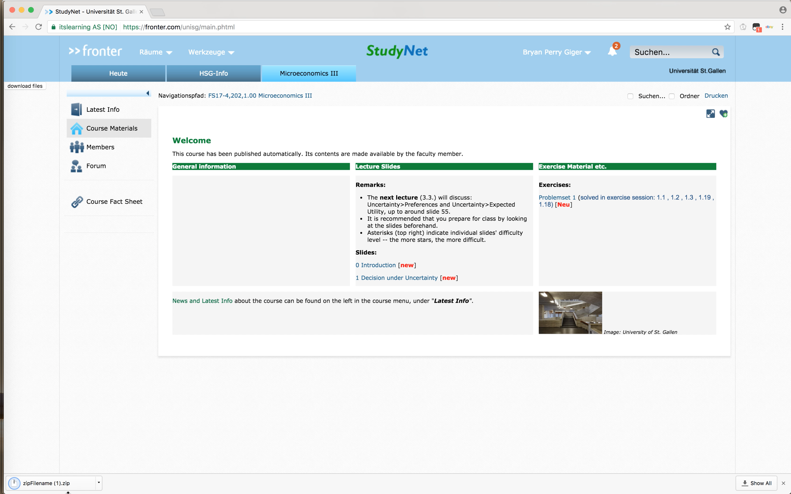

# Prettifying and improving the HSG [studynet](https://studynet.unisg.ch)

# Main Features

1. Colored Background (and Text) for the courses
2. Removing the ID from the Course Tabs - so you can see the actual name
3. <Experimental> Download Function


---

# Code

## NOTE

*There are 2 VERSIONS in this repository:*

1. **studynet_prettify_core.js**
	With only the first two functions (colored backgrounds and making the tabs readable)
2. **studynet_prettify_full.js**
 	With all functions (including the *buggy* download one)

The First two features work properly in most major browsers (tested on firefox, safari and chrome)
The Experimental download funciton seems to only work on chrome/chromium at the moment.

---

# Installation

## 1. installing the required extensions
If you are using Chrome or Safari: Use [TamperMonkey](http://tampermonkey.net)

If you are using Firefox: Use [GreaseMonkey](http://www.greasespot.net)

Follow the instructions and install it as an extension on your browser.

These programs will allow you to run the code that changes the studynet interface and adds the additional feauters.

---

## 2. Installing the script (actual code)

First, Download the .js (javascript) file you want/need and open it in a text editor (e.g. notepad, textedit)

### Safari/Chrome

1. Click on the tampermonkey icon and select "Add New Script"


2. Click on the tampermonkey icon and select "Add New Script", dont forget to fill in the 'update url'


3. Hit save, and you're good to go

---

### Firefox:

1. Select the tampermonkey extention asd click 'New User script'


2. enter the following details:


3. Paste the code here - Dont forget to type the 'allow pasting' to allow you to paste



## 3. Modifying the Script

You may modify the colours you want to assign to classes. At the very top of the code, you will see some thing like.

There will be multiple *comma separated* blocks of {curly brackets}, each block corresponds to a course.

*NOTE* you may add more blocks, but please dont forget the **commas** between them.

```javascript
   var courseList = [
        {
            'course': 'Microeconomics',
            'bg_color': '#FFCC66',
            'text_color':'#000000',
        },
        ...
    ]
```
this is called a json (pronounced j-son) array, and it contains the data the program needs to correctly assign the colors. You will note a few things:

on the left side of the colon is a variable, and on the right side is the value - i.e.

```
	variable : value
```
DO NOT change the variable, only the values, and only in the following way:

```javascript
	{
		'course': 'name of the course that you want to apply a color to',
		'bg_color': 'the hexadecimal (hex) code of the background color you want',
		'text_color': 'the hex code of the text color you want'
	}
```

### COURSE  
1. The name doesnt have to be exact, it just has to be a subset of the actual name.
	
	e.g. If we have 'Microeconomics' as our name, it will match all rows with "Microeconomics" in it, including things like "Microeconomics 3" and "Microeconomics Exercises".

2. Capitalization is important
3. Commas are important, make sure your lines end with a comma


### HEX CODES

In the web, colors are usually represented via hex codes. you can head to [Color Picker](http://www.colorpicker.com) and just pick the colors you want.

Don't forget the Hashtag (#) at the front of the 6 character code.

---
# Download Function

The button must be *pressed* while you're in the course materials page. you will get a zip file with the data.

**NOTE here are some quirks:**

1. you must refresh the site after every course/materials you download
2. the course must be in the third tab
3. Some file extensions do not appear
4. There is no progress bar: depending on the number of links on the website, might take a while (you can check the web console though)
5. Does not work in Safari

[](https://www.dropbox.com/s/dms7myveyrxwrn0/download_file_demo.mov?dl=0)


This still needs debugging and improvement.

---
## Security note: only install scripts you trust, I will not be responsible for any other scripts you install.